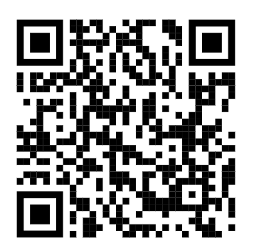

::: title-cover


<h1><strong>Ansiedad Matemática</strong></h1>

<p class="cover-subtitle">
<strong>Definiciones, mediciones y enfoques de análisis en la literatura empírica reciente</strong>
</p>

<hr class="title-divider"/>

<p class="title-meta">
<strong>Katherine Aravena Herrera</strong><br>
Seminario de Investigación I<br>
Magíster en Psicología Educacional 
</p>
:::

# Introducción {.xlarge data-background-color="#009366"}

## Ansiedad matemática {.text-wide}

::: {.intro-subtitle}
Una dimensión emocional del aprendizaje matemático, la experiencia de aprender matemática.
:::

::: {.intro-two-cols}

::: {.intro-card}
<h3>¿Qué es?</h3>

- Malestar, tensión o preocupación frente a situaciones matemáticas.  
  <span class="microcite">[@hembree1990nature; @ashcraft2002math]</span>
- Puede aparecer en clases, pruebas, ejercicios o participación oral.  
  <span class="microcite">[@dowker2016mathematics]</span>
- No siempre ocurre solo durante la tarea: también puede anticiparse.  
  <span class="microcite">[@ashcraft2002math; @dowker2016mathematics]</span>
:::

::: {.intro-card}
<h3>¿Por qué importa en educación?</h3>

- Se asocia con rendimiento, desempeño y actitudes hacia la matemática.  
  <span class="microcite">[@hembree1990nature; @dowker2016mathematics]</span>
- Puede relacionarse con evitación de actividades o trayectorias matemáticas.  
  <span class="microcite">[@ashcraft2002math]</span>
- Permite mirar cómo viven la matemática, no solo el rendimiento.
  <span class="microcite">[@dowker2016mathematics]</span>
:::

:::

## Problema de revisión {.text-wide}

::: {.intro-subtitle}
Una literatura es amplia y heterogénea.
:::

::: {.intro-two-cols}

::: {.intro-card}
<h3>Problema de la literatura</h3>

- La literatura reciente estudia la ansiedad matemática de diversas formas.  
  <span class="microcite">[@dowker2016mathematics]</span>
- Varían las definiciones, instrumentos, poblaciones y métodos.
  <span class="microcite">[@dowker2016mathematics]</span>
- Esa diversidad dificulta comparar resultados y reconocer patrones comunes.
  <span class="microcite">[@grant2009typology; @munn2018systematic]</span>
:::

::: {.intro-card}
<h3>Aporte de la revisión</h3>

- Permite entender la ansiedad matemática como parte de la experiencia escolar.
  <span class="microcite">[@grant2009typology; @munn2018systematic]</span>
- Ayuda a ordenar su vínculo con rendimiento, motivación, confianza y trayectorias educativas.
  <span class="microcite">[@page2021prisma]</span>
- Aporta al campo educativo al identificar patrones, tensiones y vacíos de investigación.
  <span class="microcite">[@munn2018systematic]</span>
:::

:::

# ¿Cómo define, mide y analiza la literatura empírica reciente la ansiedad matemática en estudiantes de educación escolar? y ¿Qué dimensiones educativas se asocian a este fenómeno? {.question-title-slide data-background-color="#009366"}

## Objetivos {.text-wide}

**Objetivo general**\
Caracterizar cómo la literatura reciente define, mide y analiza la ansiedad matemática, y qué dimensiones educativas aparecen asociadas.

**Objetivos específicos**

::: {.obj-list .incremental}
1.  **Definiciones y operacionalización:** Identificar definiciones y formas de operacionalización de la ansiedad matemática.

2.  **Instrumentos y métodos:** Describir instrumentos, diseños y enfoques metodológicos utilizados en los estudios.

3.  **Dimensiones educativas:** Sistematizar las dimensiones educativas asociadas a la ansiedad matemática en estudiantes de educación escolar.

:::


# Metodología {.xlarge data-background-color="#009366"}

## Bases de datos empleadas {.method-slide .search-bases-slide}

::: {.method-subtitle}
Búsqueda en tres bases complementarias
:::

::: {.method-card-grid .three}

::: {.method-card .database-card}

<h3>ERIC</h3>
Investigación educativa
:::

::: {.method-card .database-card}

<h3>Scopus</h3>
Cobertura internacional y multidisciplinaria
:::

::: {.method-card .database-card}

<h3>Web of Science</h3>
Literatura indexada y revisada
:::

:::


## Ecuación de búsqueda {.method-slide .boolean-slide}

::: {.method-subtitle}
Tres bloques conceptuales y un bloque de exclusión
:::

::: {.boolean-flow}

::: {.boolean-block}
Ansiedad matemática
:::

::: {.boolean-operator}
AND
:::

::: {.boolean-block}
Población escolar
:::

::: {.boolean-operator}
AND
:::

::: {.boolean-block}
Aprendizaje / rendimiento
:::

::: {.boolean-operator .not}
NOT
:::

::: {.boolean-block .exclusion}
Revisiones · educación superior · formación docente
:::

:::

::: {.search-code}
```text
("math anxiety" OR "mathematics anxiety" OR "mathematical anxiety" OR "ansiedad matemática" OR "ansiedad hacia las matemáticas" OR "ansiedad ante las matemáticas" OR "ansiedad en matemáticas")
AND (student* OR pupil* OR school* OR child* OR adolescent* OR "primary education" OR "secondary education" OR "elementary school" OR "middle school" OR "high school" OR "primary school" OR "secondary school" OR escolar* OR estudiante* OR alumno* OR niño* OR niña* OR adolescente* OR "educación primaria" OR "educación secundaria" OR primaria OR secundaria OR colegio OR escuela)
AND ("math achievement" OR "mathematics achievement" OR "math performance" OR "mathematics performance" OR "mathematical literacy" OR "math test scores" OR "math learning" OR "mathematics learning" OR "math attainment" OR "mathematics attainment" OR "problem solving" OR "mathematical problem solving" OR "math skills" OR "mathematical skills" OR "academic achievement" OR "academic performance" OR "school experience" OR motivation OR "math motivation" OR "attitudes toward mathematics" OR "rendimiento matemático" OR "desempeño matemático" OR "logro matemático" OR "aprendizaje matemático" OR "aprendizaje de las matemáticas" OR "aprendizaje en matemáticas" OR "competencia matemática" OR "alfabetización matemática" OR "habilidades matemáticas" OR "destrezas matemáticas" OR "resolución de problemas" OR "resolución de problemas matemáticos" OR "puntajes en matemáticas" OR "resultados en matemáticas" OR "calificaciones en matemáticas" OR "pruebas de matemáticas" OR "evaluación matemática" OR "rendimiento académico" OR "desempeño académico" OR "logro académico" OR "experiencia escolar" OR motivación OR "motivación matemática" OR "actitudes hacia las matemáticas")
AND NOT ("systematic review" OR "meta-analysis" OR "literature review" OR "scoping review" OR review OR university OR undergraduate OR college OR "higher education" OR "pre-service teacher" OR "preservice teacher" OR "teacher education" OR "revisión sistemática" OR "revision sistematica" OR metaanálisis OR "meta análisis" OR "meta-analisis" OR "revisión de literatura" OR "revision de literatura" OR "educación superior" OR "educacion superior" OR universidad OR universitario* OR pregrado OR "formación docente" OR "formacion docente" OR "formación de profesores" OR "formacion de profesores" OR "formación inicial docente" OR "formacion inicial docente")
```
:::


## Criterios {.method-slide .criteria-slide}

::: {.criteria-two-cols}

::: {.criteria-card .include}
<h3>Incluye</h3>
<ul>
<li>Artículos empíricos y cuantitativos</li>
<li>Publicados entre 2021 y 2026</li>
<li>Estudiantes de educación escolar</li>
<li>Medición explícita de ansiedad matemática</li>
<li>Inglés y español</li>
<li>Dimensión educativa asociada</li>
</ul>
:::

::: {.criteria-card .exclude}
<h3>Excluye</h3>
<ul>
<li>Revisiones o metaanálisis</li>
<li>Educación superior</li>
<li>Formación docente o docentes</li>
<li>Sin medición directa de ansiedad matemática</li>
<li>Sin población escolar</li>
</ul>
:::

:::


## Proceso de selección {.method-slide .selection-flow-slide}

:::: {.selection-content-wrapper}

::: {.selection-flow}

::: {.selection-step}
<span class="flow-number">1.369</span>
<span class="flow-label">registros iniciales</span>
:::

::: {.flow-arrow}
↓ filtros
:::

::: {.selection-step}
<span class="flow-number">591</span>
<span class="flow-label">registros exportados</span>
:::

::: {.flow-arrow}
↓ deduplicación
:::

::: {.selection-step}
<span class="flow-number">346</span>
<span class="flow-label">registros únicos</span>
:::

::: {.flow-arrow}
↓ cribado y revisión
:::

::: {.selection-step}
<span class="flow-number">20</span>
<span class="flow-label">textos completos revisados</span>
:::

::: {.flow-arrow}
↓ selección final
:::

::: {.selection-step .final}
<span class="flow-number">10</span>
<span class="flow-label">10 artículos principales</span>
:::

:::

::: {.selection-source-breakdown}

::: {.source-phase-card}
**Registros iniciales**

<table>
  <thead>
    <tr>
      <th>Base de datos</th>
      <th>Registros</th>
    </tr>
  </thead>
  <tbody>
    <tr>
      <td>Scopus</td>
      <td>438</td>
    </tr>
    <tr>
      <td>Web of Science</td>
      <td>619</td>
    </tr>
    <tr>
      <td>ERIC</td>
      <td>312</td>
    </tr>
    <tr class="total-row">
      <td><strong>Total inicial</strong></td>
      <td><strong>1.369</strong></td>
    </tr>
  </tbody>
</table>
:::

::: {.source-phase-card}
**Registros exportados**

<table>
  <thead>
    <tr>
      <th>Base de datos</th>
      <th>Registros</th>
    </tr>
  </thead>
  <tbody>
    <tr>
      <td>Scopus</td>
      <td>233</td>
    </tr>
    <tr>
      <td>Web of Science</td>
      <td>240</td>
    </tr>
    <tr>
      <td>ERIC</td>
      <td>118</td>
    </tr>
    <tr class="total-row">
      <td><strong>Total exportado</strong></td>
      <td><strong>591</strong></td>
    </tr>
  </tbody>
</table>
:::

:::

::::

```{=html}
<style>
/* Desglose por base de datos en proceso de selección */
.reveal .selection-flow-slide .selection-source-breakdown {
  display: grid !important;
  grid-template-columns: repeat(2, minmax(260px, 1fr)) !important;
  gap: 0.75rem !important;
  max-width: 760px !important;
  margin: 1.25rem auto 0.35rem auto !important;
  align-items: start !important;
}

.reveal .selection-flow-slide .source-phase-card {
  background: #ffffff !important;
  border: 1px solid rgba(0, 0, 0, 0.07) !important;
  border-left: 4px solid #0b6b57 !important;
  border-radius: 0.65rem !important;
  padding: 0.4rem 0.6rem !important;
  box-shadow: 0 2px 8px rgba(0, 0, 0, 0.035) !important;
}

.reveal .selection-flow-slide .source-phase-card > strong {
  display: block !important;
  margin-bottom: 0.22rem !important;
  color: #0b6b57 !important;
  font-size: 0.62rem !important;
  line-height: 1.1 !important;
  font-weight: 750 !important;
}

.reveal .selection-flow-slide .source-phase-card p {
  margin: 0 0 0.22rem 0 !important;
  font-size: 0.62rem !important;
  line-height: 1.1 !important;
  font-weight: 750 !important;
  color: #0b6b57 !important;
}

.reveal .selection-flow-slide .source-phase-card table {
  width: 100% !important;
  font-size: 0.58rem !important;
  line-height: 1.1 !important;
  margin: 0 !important;
  border-collapse: collapse !important;
}

.reveal .selection-flow-slide .source-phase-card th,
.reveal .selection-flow-slide .source-phase-card td {
  padding: 0.12rem 0.2rem !important;
  border-bottom: 1px solid rgba(0, 0, 0, 0.055) !important;
}

.reveal .selection-flow-slide .source-phase-card th {
  color: #0b6b57 !important;
  font-weight: 700 !important;
}

.reveal .selection-flow-slide .source-phase-card td:last-child,
.reveal .selection-flow-slide .source-phase-card th:last-child {
  text-align: right !important;
}

.reveal .selection-flow-slide .source-phase-card tr.total-row td {
  border-bottom: none !important;
  font-weight: 800 !important;
  color: #0b6b57 !important;
}

.reveal .selection-flow-slide .selection-side-note,
.reveal .selection-flow-slide .method-footnote {
  font-size: 0.55rem !important;
  line-height: 1.1 !important;
  margin-top: 0.3rem !important;
  margin-bottom: 0 !important;
  text-align: center !important;
  color: #666 !important;
}

.reveal .slides section#python-scripts-slide,
.reveal .slides section#tools-slide {
  top: 50% !important;
  transform: translateY(-50%) !important;
  height: auto !important;
  display: block !important;
  margin-top: 0 !important;
}
.reveal .slides section#python-scripts-slide h2,
.reveal .slides section#tools-slide h2 {
  font-size: 1.3rem !important;
  margin-bottom: 0.3rem !important;
  text-align: center !important;
  position: relative !important;
  top: auto !important;
  transform: none !important;
}
.reveal .slides section#python-scripts-slide .method-subtitle,
.reveal .slides section#tools-slide .method-subtitle {
  font-size: 0.85rem !important;
  text-align: center !important;
  margin-bottom: 1rem !important;
  color: var(--secondary) !important;
}
.reveal .slides section#python-scripts-slide .scripts-two-cols {
  display: flex !important;
  justify-content: center !important;
  gap: 0.75rem !important;
  width: 90% !important;
  margin: 0 auto !important;
}
.reveal .slides section#python-scripts-slide .script-card {
  padding: 0.7rem 0.85rem !important;
}
.reveal .slides section#python-scripts-slide .script-card h3 {
  font-size: 0.95rem !important;
  margin-bottom: 0.25rem !important;
}
.reveal .slides section#python-scripts-slide .script-card li {
  font-size: 0.66rem !important;
  line-height: 1.15 !important;
  margin-bottom: 0.15rem !important;
}
.reveal .slides section#python-scripts-slide .rubric-box,
.reveal .slides section#python-scripts-slide .human-decision-bar {
  font-size: 0.62rem !important;
  line-height: 1.15 !important;
  padding: 0.45rem 0.6rem !important;
  margin-top: 0.4rem !important;
}

.reveal .tools-flow {
  display: grid !important;
  grid-template-columns: 1fr auto 1fr auto 1fr auto 1fr !important;
  gap: 0.55rem !important;
  align-items: center !important;
  margin-top: 0.8rem !important;
  margin-bottom: 0.9rem !important;
}

.reveal .tool-step {
  text-align: center !important;
  min-height: 125px !important;
  display: flex !important;
  flex-direction: column !important;
  justify-content: center !important;
}

.reveal .tool-step.human {
  background: rgba(11, 107, 87, 0.055) !important;
}

.reveal .tool-step.final {
  border-left-color: #0b6b57 !important;
}

.reveal .tool-arrow {
  color: #0b6b57 !important;
  font-size: 1.35rem !important;
  font-weight: 800 !important;
}

.reveal .chatgpt-note {
  margin: 0.65rem auto !important;
  max-width: 720px !important;
  padding: 0.55rem 0.75rem !important;
  border-radius: 0.5rem !important;
  background: rgba(95, 111, 124, 0.07) !important;
  color: #4f5b66 !important;
  font-size: 0.78rem !important;
  text-align: center !important;
}

.reveal .method-highlight {
  margin-top: 0.8rem !important;
  padding: 0.7rem 0.9rem !important;
  background: rgba(11, 107, 87, 0.075) !important;
  color: #0b6b57 !important;
  border-radius: 0.55rem !important;
  font-size: 0.95rem !important;
  font-weight: 700 !important;
  text-align: center !important;
}
</style>
```

## ¿Qué hicieron los scripts de Python? {#python-scripts-slide .method-slide .python-scripts-slide}

::: {.method-subtitle}


:::


::: {.scripts-two-cols}

::: {.script-card .script-one}
<h3>Preparación de la base bibliográfica</h3>

::: {.script-label}
Idea clave: limpió, ordenó, normalizó y deduplicó la base.
:::

::: {.script-flow}
591 registros exportados → 346 registros únicos
:::

<ul>
<li>Leyó exportaciones de ERIC, Scopus y Web of Science.</li>
<li>Diagnosticó problemas en los datos.</li>
<li>Normalizó campos bibliográficos.</li>
<li>Unificó registros en una sola matriz.</li>
<li>Eliminó duplicados por DOI y título.</li>
</ul>
:::

::: {.script-card .script-two}
<h3>Cribado asistido y priorización</h3>

::: {.script-label}
Idea clave: preclasificó y priorizó registros para revisión.
:::

::: {.script-flow}
346 registros únicos → 20 candidatos preliminares
:::

<ul>
<li>Construyó texto de cribado.</li>
<li>Buscó señales de inclusión y exclusión.</li>
<li>Clasificó registros como incluir probable, excluir probable o dudoso.</li>
<li>Aplicó una rúbrica de prioridad de 0 a 14 puntos.</li>
<li>Priorizó candidatos para revisión.</li>
</ul>

:::

:::

::: {.rubric-box}
Rúbrica 0–14: C1 ansiedad matemática · C2 población escolar · C3 medición explícita · C4 dimensión educativa · C5 aporte metodológico · C6 aporte a objetivos · C7 diversidad del corpus.<br>
Cada criterio: 0–2 puntos. Prioriza; no decide.
:::

::: {style="display: flex; justify-content: center; width: 100%; margin-top: 15px;"}
<span class="microcite" style="text-align: center;">[@rethlefsen2021prisma]</span>
:::

## Sobre el uso de IA 

::: {.ia-declaration} 

Se utilizó ChatGPT como herramienta de apoyo y asistencia durante el proceso de investigación. 
Su uso se concentró en la planificación metodológica, formulación de ecuaciones de búsqueda, apoyo en la implementación de scripts de Python y organización de la presentación. 
:::

{fig-align="center" width="250"}

# Resultados {.xlarge data-background-color="#009366"}

## Caracterización y síntesis del corpus {.results-slide .corpus-integrated-slide}

::: {.corpus-table-wrap}

| Rasgo del corpus | Resultado |
|---|---|
| **Periodo de publicación** | 2022–2026 |
| **Artículos principales** | 10 |
| **Contextos** | Europa, Asia, África y estudios comparativos |
| **Niveles educativos** | Primaria y secundaria |
| **Enfoques metodológicos** | SEM, multinivel, regresión y path analysis |
| **Foco común** | Ansiedad matemática y desempeño/aprendizaje |
| **Variables asociadas** | Rendimiento, apoyo, género, memoria, atención y engagement |

:::

## Matriz de caracterización del corpus I {.results-slide .corpus-matrix-slide .smaller}

| Autor/a y año | País/contexto | Nivel educativo / muestra | Diseño o enfoque | Medición de ansiedad matemática | Dimensión educativa asociada | Aporte para la revisión |
|---|---|---|---|---|---|---|
| [@piccirilli2023] | Italia | 9.º grado, secundaria técnico-vocacional | Longitudinal | Escala de ansiedad matemática; AMAS como palabra clave | Habilidades matemáticas y rendimiento | Ansiedad como indicador temprano de riesgo |
| [@aras2026] | Türkiye | 330 estudiantes de 5.º a 7.º y sus padres | SEM | Parental Math Anxiety Scale y Math Anxiety Scale | Ansiedad parental, ansiedad estudiantil y rendimiento | Ansiedad estudiantil como mediadora |
| [@huang2026] | Vietnam / PISA 2022 | 6.068 estudiantes | SEM con mediaciones | Índices PISA de ansiedad matemática | Apoyo familiar, apoyo docente, género y rendimiento | Apoyo familiar/docente se asocia indirectamente al rendimiento |
| [@kusmaryono2022] | Indonesia | 100 estudiantes | Mixto, SEM, CFA y path analysis | Cuestionario Likert | Motivación, rol docente, contenido matemático y aprendizaje | Matiza la visión negativa de la ansiedad |
| [@shimizu2025] | Japón | 240 estudiantes de 11.º grado | Encuesta y SEM multigrupo | Ansiedad matemática / ansiedad de aprendizaje matemático | Engagement, autoeficacia, diagramas y resolución de problemas | Integra ansiedad, autoeficacia, heurísticas y engagement |

## Matriz de caracterización del corpus II {.results-slide .corpus-matrix-slide .smaller}

| Autor/a y año | País/contexto | Nivel educativo / muestra | Diseño o enfoque | Medición de ansiedad matemática | Dimensión educativa asociada | Aporte para la revisión |
|---|---|---|---|---|---|---|
| [@orbach2022] | Alemania | 403 escolares de 4.º y 5.º | Análisis lineales y perfiles latentes | Ansiedad estado ante prueba matemática y ansiedad general | Atención sostenida y fluidez aritmética | Vincula ansiedad, atención y rendimiento aritmético |
| [@iyamuremye2022] | Ruanda | 415 estudiantes de Senior Two / grado 8 | Cuantitativo correlacional, t-test y SEM | Cuestionario de ansiedad matemática | Enfoque docente, rendimiento, carrera y género | Relaciona enseñanza, ansiedad, desempeño y aspiraciones |
| [@finell2024] | Suecia | 429 estudiantes de grado 4, tres mediciones | Psicométrico, CFA e invariancia | Versión sueca abreviada de MARS-E, 16 ítems | Rendimiento, autoconcepto, ansiedad ante pruebas y género | Validez y confiabilidad para primaria |
| [@ma2025] | China | 92 estudiantes de 7.º grado | Correlación, regresión jerárquica y moderación | Mathematics Anxiety Scale | Memoria de trabajo y rendimiento | Memoria de trabajo modera relación ansiedad-rendimiento |
| [@guo2022] | Shanghai-China / Estados Unidos | 1.676 en Shanghai-China y 1.511 en EE.UU. | Modelos multinivel y path analysis | Índice PISA de ansiedad matemática | Oportunidad de aprender, problemas y rendimiento | Ansiedad como mediadora entre oportunidades y desempeño |


## Resultado 1: definiciones y operacionalización {.results-slide .result-detail-slide .text-wide}

::: {.results-lead}
**Objetivo 1:** Identificar definiciones y formas de operacionalización de la ansiedad matemática.
:::

::: {.result-highlight}
Hallazgo principal: el corpus define la ansiedad matemática como una respuesta emocional específica frente a tareas matemáticas, asociada a tensión, miedo, preocupación, incomodidad o evitación.
:::

:::: {.result-list-cols}

::: {.result-col}

<h3>Cómo se define</h3> <ul class="clean-result-list"> <li>Malestar emocional frente a números, cálculo o resolución de problemas.</li> <li>Reacción específica ante situaciones matemáticas.</li> <li>Puede aparecer como miedo, tensión, preocupación, incomodidad o rechazo.</li> </ul>
:::

::: {.result-col}

<h3>Cómo se mide</h3> <ul class="clean-result-list"> <li>Escalas específicas de ansiedad matemática.</li> <li>Cuestionarios tipo Likert.</li> <li>Índices derivados de evaluaciones internacionales.</li> <li>Medidas diferenciadas de ansiedad matemática, ansiedad general o ansiedad ante pruebas.</li> </ul>
:::

::: {.result-col}

<h3>Qué muestra el corpus</h3> <ul class="clean-result-list"> <li>La ansiedad matemática se transforma en una variable observable.</li> <li>Permite comparar niveles de ansiedad entre estudiantes.</li> <li>Abre la posibilidad de relacionarla con aprendizaje, rendimiento y experiencia escolar.</li> </ul>
:::

::::

::: {.slide-citations}
[@piccirilli2023; @finell2024; @ma2025; @guo2022; @huang2026]
:::

::: {.notes}
En relación con el primer objetivo, el corpus muestra que la ansiedad matemática se define principalmente como una respuesta emocional específica frente a situaciones matemáticas. Aparece asociada con tensión, miedo, preocupación, incomodidad o evitación. Lo importante es que los estudios no la trabajan solo como una idea general, sino como un constructo medible, a través de escalas, cuestionarios o índices estandarizados. Esto permite conectarla empíricamente con aprendizaje, rendimiento y experiencia escolar.
:::

## Resultado 2: instrumentos, diseños y métodos {.results-slide .result-detail-slide .text-wide}

::: {.results-lead}
Objetivo 2: Describir instrumentos, diseños y enfoques metodológicos utilizados en los estudios.
:::

::: {.result-highlight}
Hallazgo principal: predominan instrumentos psicométricos y modelos cuantitativos de relaciones complejas, orientados a explicar cómo la ansiedad matemática se vincula con otros factores educativos.
:::

:::: {.result-list-cols}

::: {.result-col}

<h3>Instrumentos</h3> <ul class="clean-result-list"> <li>AMAS y escalas de ansiedad matemática.</li> <li>MARS-E y estudios de validez/confiabilidad.</li> <li>Índices PISA de ansiedad matemática.</li> <li>Cuestionarios sobre apoyo, enseñanza, motivación, autoeficacia o engagement.</li> </ul>
:::

::: {.result-col}

<h3>Diseños y muestras</h3> <ul class="clean-result-list"> <li>Estudios transversales y longitudinales.</li> <li>Muestras escolares de primaria y secundaria.</li> <li>Estudios nacionales y comparativos.</li> <li>Uso de datos primarios y bases internacionales como PISA.</li> </ul>
:::

::: {.result-col}

<h3>Estrategias analíticas</h3> <ul class="clean-result-list"> <li>SEM, CFA y path analysis.</li> <li>Regresiones y modelos multinivel.</li> <li>Mediaciones y moderaciones.</li> <li>Perfiles latentes y análisis psicométricos.</li> </ul>
:::

::::

::: {.slide-citations}
[@piccirilli2023; @aras2026; @huang2026; @finell2024; @guo2022; @orbach2022; @shimizu2025; @ma2025]
:::

::: {.notes}
Respecto del segundo objetivo, los estudios muestran un fuerte predominio de instrumentos psicométricos y modelos cuantitativos. Aparecen escalas específicas, como AMAS o MARS-E, índices PISA y cuestionarios sobre apoyo, enseñanza, autoeficacia o engagement. En términos metodológicos, predominan SEM, CFA, path analysis, regresiones, modelos multinivel, mediaciones, moderaciones y perfiles latentes. Esto muestra que la literatura busca modelar relaciones complejas, no solo describir la ansiedad matemática.
:::

## Resultado 3: dimensiones educativas asociadas {.results-slide .result-detail-slide .text-wide}

::: {.results-lead}
Objetivo 3: Sistematizar las dimensiones educativas asociadas a la ansiedad matemática en estudiantes de educación escolar.
:::

::: {.result-highlight}
Hallazgo principal: la ansiedad matemática se asocia de forma recurrente con rendimiento y aprendizaje, pero también con dimensiones escolares, familiares, cognitivas y afectivas.
:::

:::: {.result-list-cols}

::: {.result-col}

<h3>Rendimiento y aprendizaje</h3> <ul class="clean-result-list"> <li>Desempeño matemático.</li> <li>Logro académico.</li> <li>Adquisición de habilidades.</li> <li>Fluidez aritmética.</li> <li>Resolución de problemas.</li> </ul>
:::

::: {.result-col}

<h3>Contexto familiar y escolar</h3> <ul class="clean-result-list"> <li>Apoyo familiar y docente.</li> <li>Enfoque de enseñanza.</li> <li>Oportunidad de aprender.</li> <li>Expectativas y presión académica.</li> </ul>
:::

::: {.result-col}

<h3>Procesos cognitivos y afectivos</h3> <ul class="clean-result-list"> <li>Memoria de trabajo y atención.</li> <li>Autoeficacia y engagement.</li> <li>Motivación.</li> <li>Género.</li> </ul>
:::

::::

::: {.slide-citations}
[@piccirilli2023; @huang2026; @orbach2022; @shimizu2025; @iyamuremye2022; @ma2025; @guo2022; @aras2026; @kusmaryono2022]
:::

::: {.notes}
Para el tercer objetivo, la ansiedad matemática aparece asociada con rendimiento, aprendizaje y experiencia escolar. Se vincula con desempeño, logro, fluidez aritmética, adquisición de habilidades y resolución de problemas. Pero también se relaciona con apoyo familiar y docente, oportunidad de aprender, enfoque de enseñanza, memoria de trabajo, atención, autoeficacia, engagement, motivación y género. Por eso, no se puede entender solo como un problema individual, sino como una dimensión situada en condiciones educativas más amplias.
:::

## Síntesis transversal: ansiedad matemática como mecanismo intermedio {.results-slide .result-synthesis-slide .text-wide}

::: {.results-lead}
Síntesis de resultados: la ansiedad matemática articula emoción, cognición, contexto escolar y rendimiento.
:::

::: {.result-highlight}
Hallazgo transversal: en varios estudios, la ansiedad matemática funciona como mediadora, moderadora o variable asociada entre condiciones familiares/escolares, procesos cognitivos y resultados educativos.
:::

::: {.synthesis-flow-compact}

::: {.flow-row}
<span class="flow-title">Condiciones familiares y escolares</span>
<span class="flow-text">apoyo familiar · apoyo docente · enfoque de enseñanza · oportunidad de aprender · ansiedad parental</span>
:::

::: {.flow-arrow-compact}
↓
:::

::: {.flow-row}
<span class="flow-title">Procesos cognitivos y afectivos</span>
<span class="flow-text">memoria de trabajo · atención · autoeficacia · engagement · motivación</span>
:::

::: {.flow-arrow-compact}
↓
:::

::: {.flow-row}
<span class="flow-title">Ansiedad matemática</span>
<span class="flow-text">tensión · miedo · preocupación · evitación · presión</span>
:::

::: {.flow-arrow-compact}
↓
:::

::: {.flow-row}
<span class="flow-title">Resultados educativos</span>
<span class="flow-text">rendimiento · logro · fluidez aritmética · resolución de problemas · trayectoria matemática</span>
:::

:::

::: {.slide-citations}
[@aras2026; @huang2026; @iyamuremye2022; @ma2025; @guo2022; @orbach2022; @shimizu2025]
:::

::: {.notes}
Como síntesis transversal, la ansiedad matemática aparece como un mecanismo intermedio. En algunos estudios media la relación entre apoyo familiar o docente y rendimiento; en otros, su relación con el desempeño depende de variables como memoria de trabajo, atención o engagement. También puede estar asociada a la ansiedad parental o a la oportunidad de aprender. Entonces, el aporte de esta revisión es mostrar que la ansiedad matemática conecta emoción, cognición, contexto escolar y resultados educativos.
:::

# Gracias por su atención! 

-   **Github del proyecto:** <https://github.com/KAravena/ansiedad-matematica-revision>


## Referencias {.smaller}

::: {#refs}
:::

